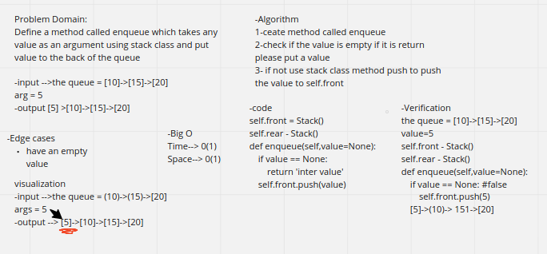
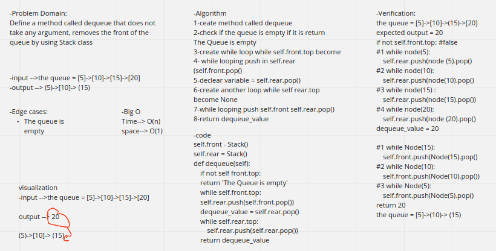
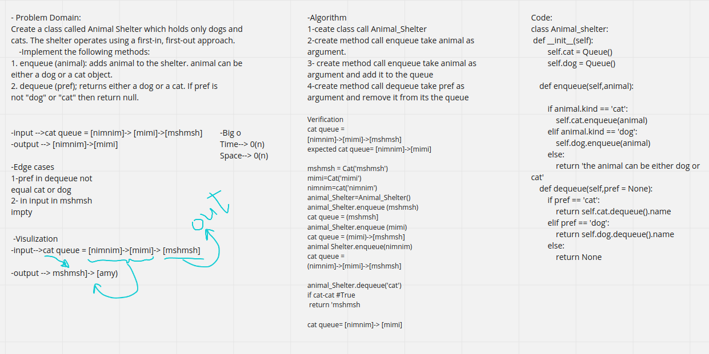
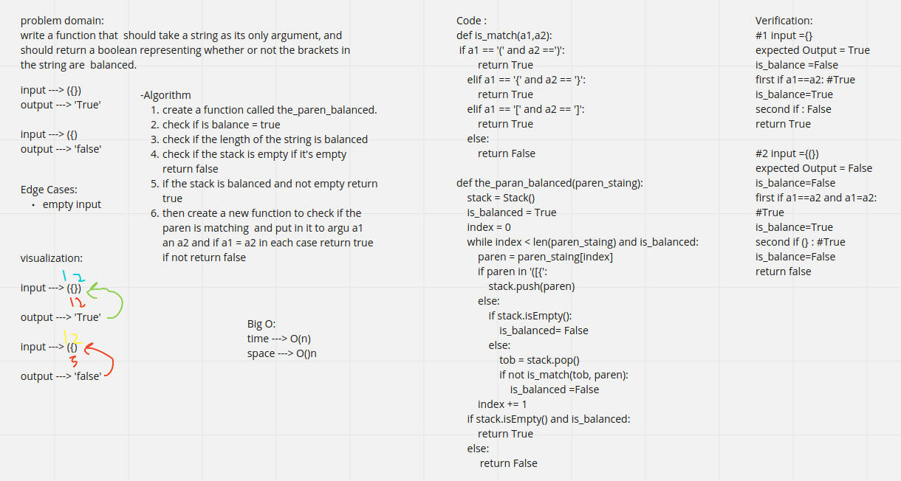

# Singly Linked List
<!-- Short summary or background information -->
##  Linked List
* Create a Linked List class
* Within your Linked List class, include a head property. 
    * Upon instantiation, an empty Linked List should be created.
* The class should contain the following methods 
    * insert
        * Arguments: value
        * Returns: nothing
        * Adds a new node with that value to the head of the list with an O(1) Time performance.
    * includes 
        * Arguments: value
        * Returns: Boolean 
            * 
    Indicates whether that value exists as a Node’s value somewhere within the list.

    * to string 
        * Arguments: none
        * Returns: a string representing all the values in the Linked List, formatted as:
        * "{ a } -> { b } -> { c } -> NULL"

## Challenge
<!-- Description of the challenge -->
Utilize the Single-responsibility principle: any methods you write should be clean, reusable, abstract component parts to the whole challenge. You will be given feedback and marked down if you attempt to define a large, complex algorithm in one function definition.

<!-- ## Approach & Efficiency
What approach did you take? Why? What is the Big O space/time for this approach?

## API
Description of each method publicly available to your Linked List -->
# code challenge -11
# Challenge Summary
<!-- Description of the challenge -->
Create a brand new PseudoQueue class. Do not use an existing Queue. Instead, this PseudoQueue class will implement our standard queue interface.

enqueue(value) which inserts value into the PseudoQueue, using a first-in, first-out approach.

dequeue() which extracts a value from the PseudoQueue, using a first-in, first-out approach.
## Whiteboard Process
<!-- Embedded whiteboard image -->

## Approach & Efficiency
<!-- What approach did you take? Why? What is the Big O space/time for this approach? -->
enqueue

Ceate method called enqueue, check if the value is empty if it is return please put a value, if not use stack class method push to push the value to self.front

Big O :

    time : O(1)
    space : O(1)

dequeue

Ceate method called dequeue, check if the queue is empty if it is return The Queue is empty, create while loop while self.front.top become none, while looping push in self.rear (self.front.pop()), declear varible = self.rear.pop(), create another loop while self,rear.top become None , while looping push self.front self.rear.pop(), return dequeuevalue

Big O :

    time : O(n)
    space : O(1)

# code challenge -12

## Challenge Summary
<!-- Description of the challenge -->
* Create a class called AnimalShelter which holds only dogs and cats.
* The shelter operates using a first-in, first-out approach.
* Implement the following methods: 
    * enqueue
        * Arguments: animal 
            * animal can be either a dog or a cat object.
    * dequeue
        * Arguments: pref 
            * pref can be either "dog" or "cat"
## Whiteboard Process
<!-- Embedded whiteboard image -->

## Approach & Efficiency
<!-- What approach did you take? Why? What is the Big O space/time for this approach? -->
enqueue

enqueue(animal): adds animal to the shelter. animal can be either a dog or a cat object.

Big O :
* time : O(n)
* space : O(n)

dequeue

dequeue(pref): returns either a dog or a cat. If pref is not "dog" or "cat" then return null.

Big O :

* time : O(n)

* space : O(n)

# code challenge -13

## Challenge Summary
<!-- Description of the challenge -->
write a function that  should take a string as its only argument, and should return a boolean representing whether or not the brackets in the string are  balanced.
## Whiteboard Process
<!-- Embedded whiteboard image -->

## Approach & Efficiency
<!-- What approach did you take? Why? What is the Big O space/time for this approach? -->
create a function called the_paren_balanced, check if is balance = true, check if the length of the string is balanced, check if the stack is empty if it's empty return false, if the stack is balanced and not empty return true, then create a new function to check if the paren is matching  and put in it to argu a1 an a2 and if a1 = a2 in each case return true if not return false

Big O:
time ---> O(n)
space ---> O(n)
## Solution
<!-- Show how to run your code, and examples of it in action -->

after testing at in vs and running the code it's working 

