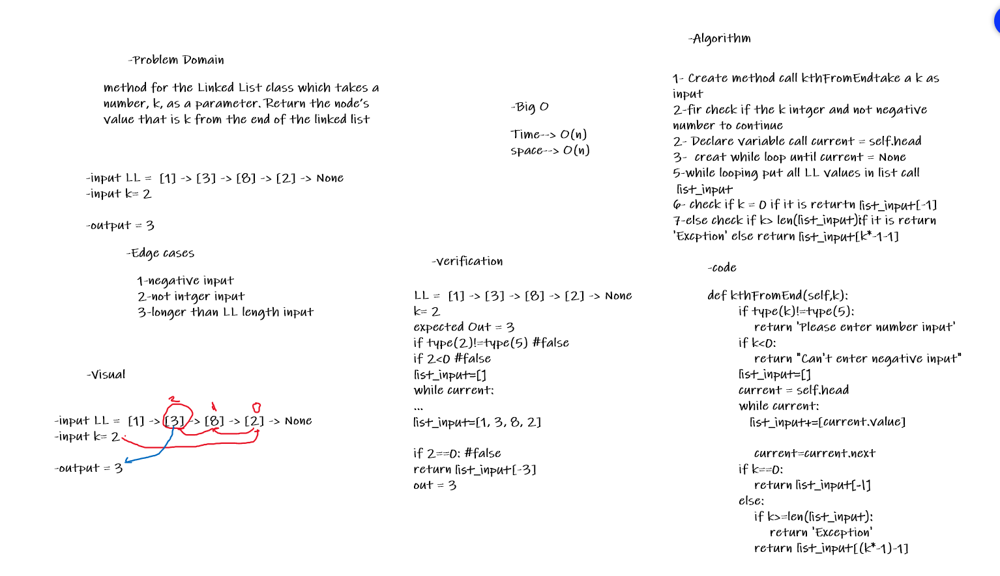

# Singly Linked List
<!-- Short summary or background information -->
##  Linked List
* Create a Linked List class
* Within your Linked List class, include a head property. 
    * Upon instantiation, an empty Linked List should be created.
* The class should contain the following methods 
    * insert
        * Arguments: value
        * Returns: nothing
        * Adds a new node with that value to the head of the list with an O(1) Time performance.
    * includes 
        * Arguments: value
        * Returns: Boolean 
            * 
    Indicates whether that value exists as a Node’s value somewhere within the list.

    * to string 
        * Arguments: none
        * Returns: a string representing all the values in the Linked List, formatted as:
        * "{ a } -> { b } -> { c } -> NULL"

## Challenge
<!-- Description of the challenge -->
Utilize the Single-responsibility principle: any methods you write should be clean, reusable, abstract component parts to the whole challenge. You will be given feedback and marked down if you attempt to define a large, complex algorithm in one function definition.

<!-- ## Approach & Efficiency
What approach did you take? Why? What is the Big O space/time for this approach?

## API
Description of each method publicly available to your Linked List -->
# Challenge Summary
<!-- Description of the challenge -->
Takes a number, k, as a parameter. Return the node’s value that is k from the end of the linked list.
## Whiteboard Process

