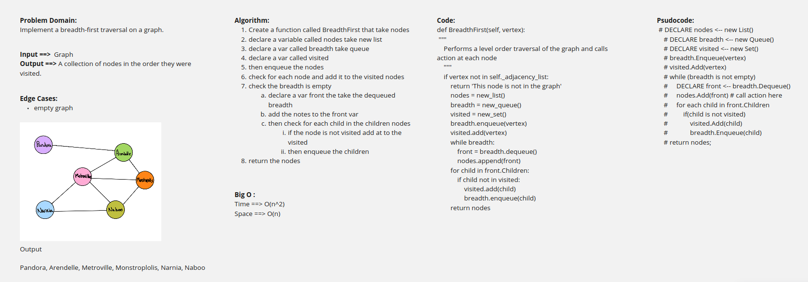

# Challenge Summary
<!-- Description of the challenge -->
Write the following method for the Graph class:
* breadth first
* Arguments: Node
* Return: A collection of nodes in the order they were visited.
* Display the collection
## Whiteboard Process
<!-- Embedded whiteboard image -->

## Approach & Efficiency
<!-- What approach did you take? Why? What is the Big O space/time for this approach? -->
Create a function called BreadthFirst that take nodes
declare a variable called nodes take new list
declare a var called breadth take queue
declare a var called visited
then enqueue the nodes
check for each node and add it to the visited nodes
check the breadth is empty
declare a var front the take the dequeued breadth
add the notes to the front var
then check for each child in the children nodes
if the node is not visited add at to the visited
then enqueue the children
return the nodes

