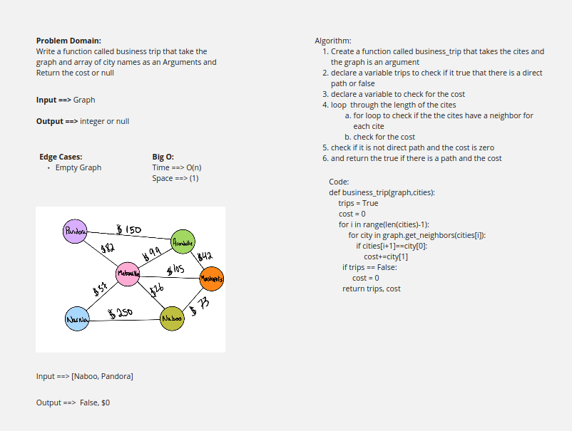

# Challenge Summary
<!-- Description of the challenge -->
Given a business trip itinerary, and an Alaska Airlines route map, is the trip possible with direct flights? If so, how much will the total trip cost be?
## Whiteboard Process
<!-- Embedded whiteboard image -->

## Approach & Efficiency
<!-- What approach did you take? Why? What is the Big O space/time for this approach? -->
Big O 
* Time ==> Big O(n) because we are checking each vertix in the graph
Space ==> big O(1) we did not creat a new space
