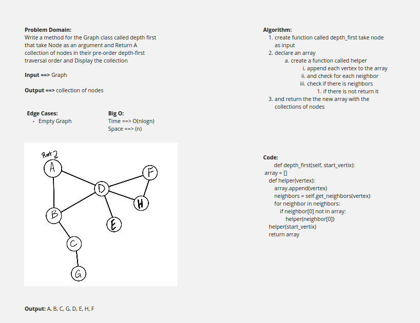

# Challenge Summary
<!-- Description of the challenge -->
Write a method for the Graph class called depth first that take Node as an argument and Return A collection of nodes in their pre-order depth-first traversal order and Display the collection
## Whiteboard Process
<!-- Embedded whiteboard image -->

## Approach & Efficiency
<!-- What approach did you take? Why? What is the Big O space/time for this approach? -->
Time ==> O(nlogn) 
Space ==> (n) we creat a new array and used a more space

