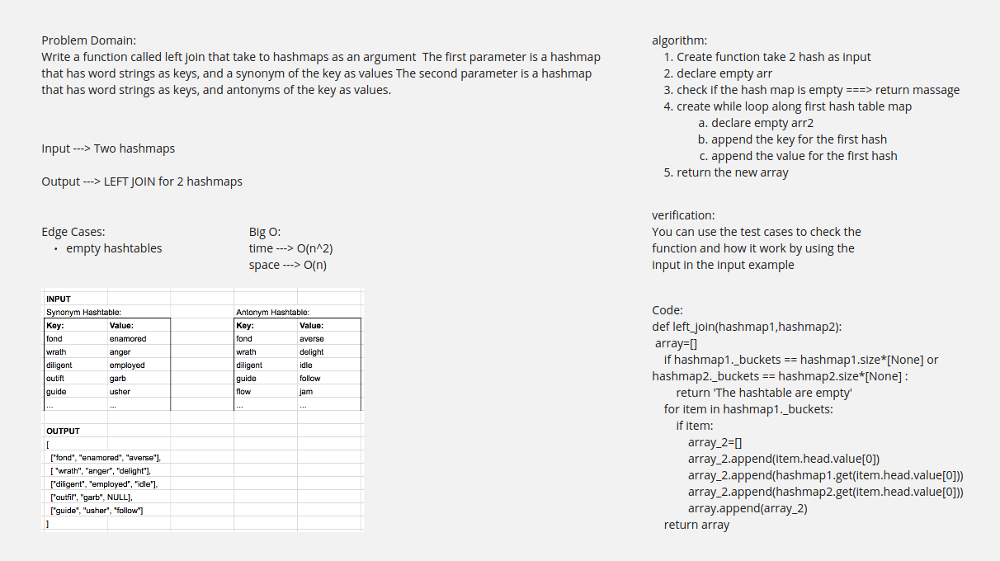

# Hashmap LEFT JOIN
<!-- Short summary or background information -->
Write a function that LEFT JOINs two hashmaps into a single data structure.
## Challenge
<!-- Description of the challenge -->
Write a function called left join that take to hashmaps as an argument  The first parameter is a hashmap that has word strings as keys, and a synonym of the key as values The second parameter is a hashmap that has word strings as keys, and antonyms of the key as values.
## Approach & Efficiency
<!-- What approach did you take? Why? What is the Big O space/time for this approach? -->
Big O:
time ---> O(n^2)
space ---> O(n)

## Solution
<!-- Embedded whiteboard image -->

