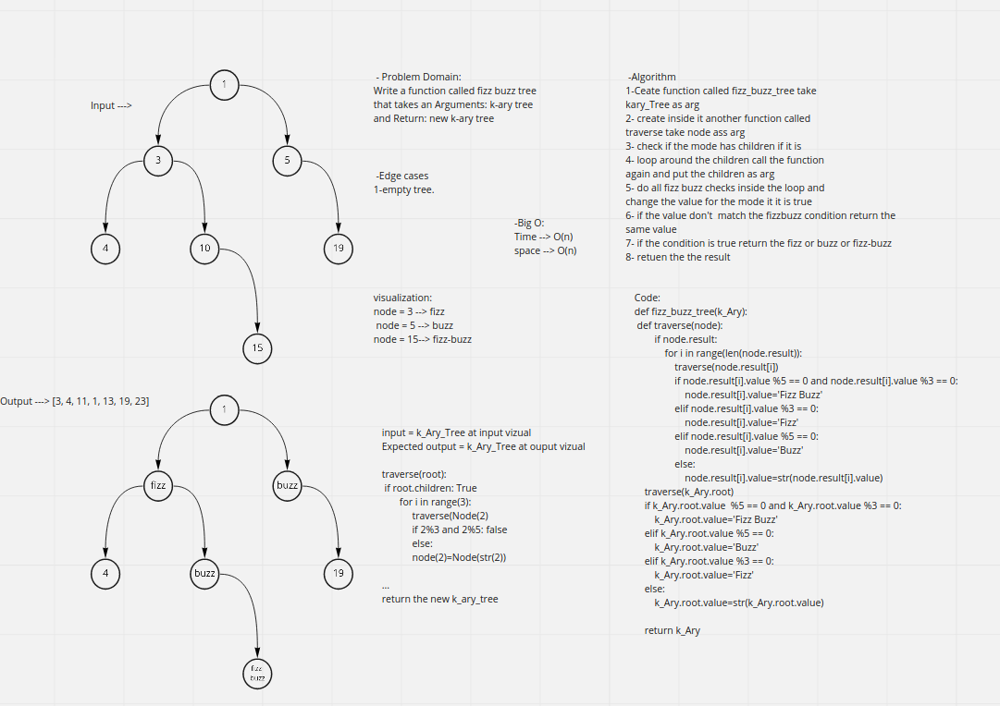

# Challenge Summary
<!-- Description of the challenge -->
Write a function called tree intersection that Find all values found to be in 2 binary trees and Return an array of matching values
## Whiteboard Process
<!-- Embedded whiteboard image -->

## Approach & Efficiency
<!-- What approach did you take? Why? What is the Big O space/time for this approach? -->
time ---> O(n)
space ---> O(n)
## Solution
<!-- Show how to run your code, and examples of it in action -->

[code solution](code-challenges/hashmap-tree-intersection/hashmap_tree_intersection/hashmap_tree_intersection/hashmap_tree_intersection.py)

