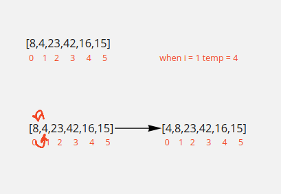
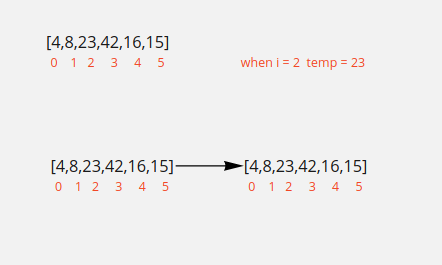
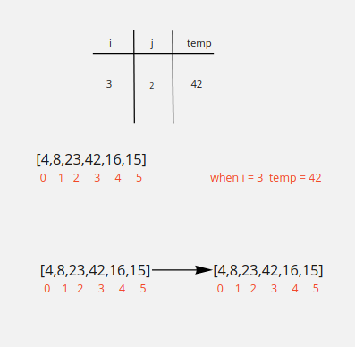
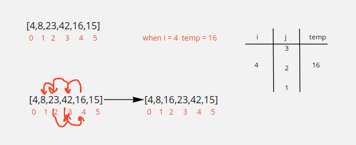
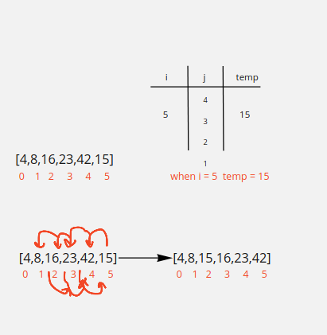

## Pseudocode

InsertionSort(int[] arr)

    FOR i = 1 to arr.length

      int j <-- i - 1
      int temp <-- arr[i]

      WHILE j >= 0 AND temp < arr[j]
        arr[j + 1] <-- arr[j]
        j <-- j - 1

      arr[j + 1] <-- temp

## trace

array [8,4,23,42,16,15]

stage #1 

__check the index 1 value if it less than index 0 replace thier values, it's true so we replace thier vlues__

stage #2

__check the index 1 value if it less than index 0 replace thier values, it's false so keep them as is__

stage #3

__check the index 1 value if it less than index 0 replace thier values, it's false so keep them as is__

stage #4

__check the index 4 value if it less than index 3 replace thier values, then check 3 and 2 it's true so we replace thier vlues__

stage #5

__check the index 5 value if it less than index 4 replace thier values, then check 4 and 3,then 3 and 2 , if it's true so we replace thier vlues__