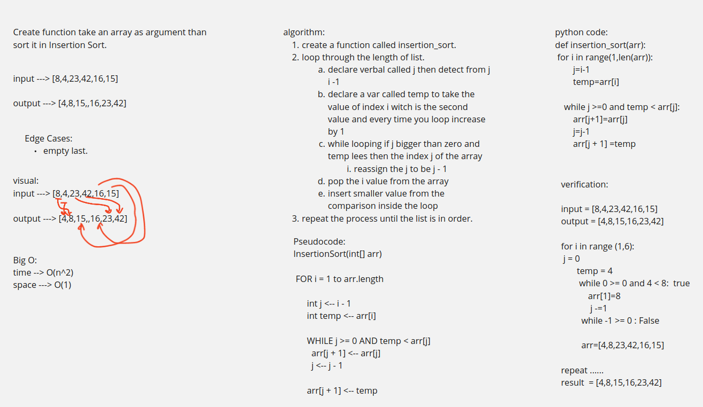

# Challenge Summary
<!-- Description of the challenge -->
Create function take an array as argument than
sort it in Insertion Sort.
## Whiteboard Process
<!-- Embedded whiteboard image -->

## Approach & Efficiency
<!-- What approach did you take? Why? What is the Big O space/time for this approach? -->
create a function called insertion_sort.
loop through the length of list.
declare verbal called j then detect from j i -1
declare a var called temp to take the value of index i witch is the second value and every time you loop increase by 1
while looping if j bigger than zero and temp lees then the index j of the array
reassign the j to be j - 1
pop the i value from the array
insert smaller value from the comparison inside the loop
repeat the process until the list is in order.
## Solution
<!-- Show how to run your code, and examples of it in action -->

input = [8,4,23,42,16,15]
output = [4,8,15,16,23,42]

    for i in range (1,6):
    j = 0
        temp = 4
            while 0 >= 0 and 4 < 8:  true
                arr[1]=8
                j -=1
            while -1 >= 0 : False

            arr=[4,8,23,42,16,15]

repeat ......
result  = [4,8,15,16,23,42]
