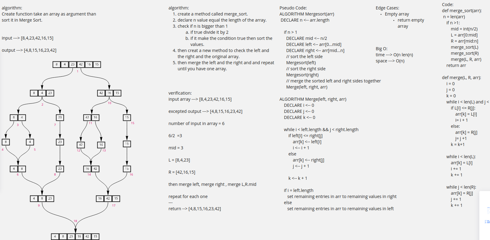

# Challenge Summary
<!-- Description of the challenge -->
Create function take an array as argument than sort it in Merge Sort.

## Whiteboard Process
<!-- Embedded whiteboard image -->

## Approach & Efficiency
<!-- What approach did you take? Why? What is the Big O space/time for this approach? -->
create a method called merge_sort.
declare n value equal the length of the array.
check if n is bigger than 1
if true divide it by 2
if it make the condition true then sort the values.
then creat a new method to check the left and the right and the original array.
then merge the left and the right and and repeat until you have one array.
