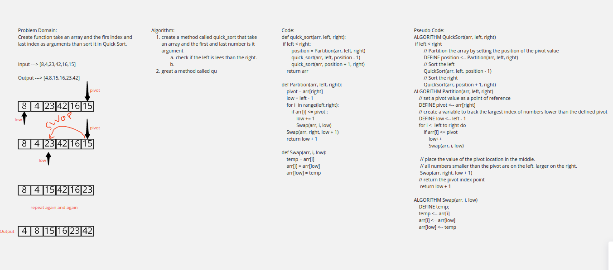

# Challenge Summary
<!-- Description of the challenge -->
Create function take an array and the firs index and last index as arguments than sort it in Quick Sort.
## Whiteboard Process
<!-- Embedded whiteboard image -->

## Approach & Efficiency
<!-- What approach did you take? Why? What is the Big O space/time for this approach? -->

## Solution
<!-- Show how to run your code, and examples of it in action -->

