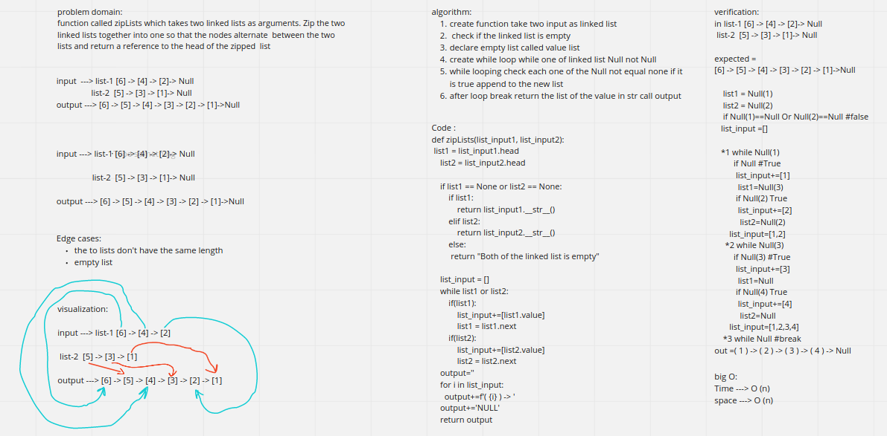

# Singly Linked List
<!-- Short summary or background information -->
##  Linked List
* Create a Linked List class
* Within your Linked List class, include a head property. 
    * Upon instantiation, an empty Linked List should be created.
* The class should contain the following methods 
    * insert
        * Arguments: value
        * Returns: nothing
        * Adds a new node with that value to the head of the list with an O(1) Time performance.
    * includes 
        * Arguments: value
        * Returns: Boolean 
            * 
    Indicates whether that value exists as a Node’s value somewhere within the list.

    * to string 
        * Arguments: none
        * Returns: a string representing all the values in the Linked List, formatted as:
        * "{ a } -> { b } -> { c } -> NULL"

## Challenge
<!-- Description of the challenge -->
Utilize the Single-responsibility principle: any methods you write should be clean, reusable, abstract component parts to the whole challenge. You will be given feedback and marked down if you attempt to define a large, complex algorithm in one function definition.

## code challenge-6

__**Utilize the Single-responsibility principle: any methods you write should be clean, reusable, abstract component parts to the whole challenge. You will be given feedback and marked down if you attempt to define a large, complex algorithm in one function definition.**__

**Write tests to prove the following functionality:**

* Can successfully add a node to the end of the linked list
* Can successfully add multiple nodes to the end of a linked list
* Can successfully insert a node before a node located i the middle of a linked list
* Can successfully insert a node before the first node of a linked list
* Can successfully insert after a node in the middle of the linked list
* Can successfully insert a node after the last node of the linked list

## code challenge-7 

__**Write tests for the following scenarios, and any other cases that help you ensure your code is working as expected.**__

* Where k is greater than the length of the linked list
* Where k and the length of the list are the same
* Where k is not a positive integer
* Where the linked list is of a size 1
* “Happy Path” where k is not at the end, but somewhere in the middle of the linked list

<!-- ## Approach & Efficiency
What approach did you take? Why? What is the Big O space/time for this approach?

## API
Description of each method publicly available to your Linked List -->
# Challenge Summary
<!-- Description of the challenge -->
function called zipLists which takes two linked lists as arguments. Zip the two linked lists together into one so that the nodes alternate  between the two lists and return a reference to the head of the zipped  list
## Whiteboard Process
<!-- Embedded whiteboard image -->

## Approach & Efficiency
<!-- What approach did you take? Why? What is the Big O space/time for this approach? -->
create function take two input as linked list, cheack if the linked list is empty, declare empty list called valuelist, create while loop while one of linked list Node not None, while looping check each one of the node not equal none if it is true appen to the new list, after loop break return the list of the value in str call x
## Solution
<!-- Show how to run your code, and examples of it in action -->
    
    in list-1 [6] -> [4] -> [2]-> Null
    list-2  [5] -> [3] -> [1]-> Null

    expected =
    [6] -> [5] -> [4] -> [3] -> [2] -> [1]->Null

        list1 = Null(1)
        list2 = Null(2)
        if Null(1)==Null Or Null(2)==Null #false
    list_input =[]

    *1 while Null(1)
            if Null #True
            list_input+=[1]
            list1=Null(3)
            if Null(2) True
            list_input+=[2]
                list2=Null(2)
        list_input=[1,2]
        *2 while Null(3)
            if Null(3) #True
            list_input+=[3]
            list1=Null
            if Null(4) True
            list_input+=[4]
                list2=Null
        list_input=[1,2,3,4]
        *3 while Null #break
    out =( 1 ) -> ( 2 ) -> ( 3 ) -> ( 4 ) -> Null